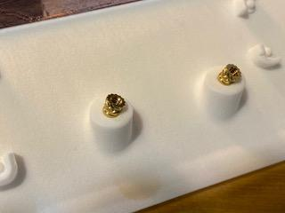
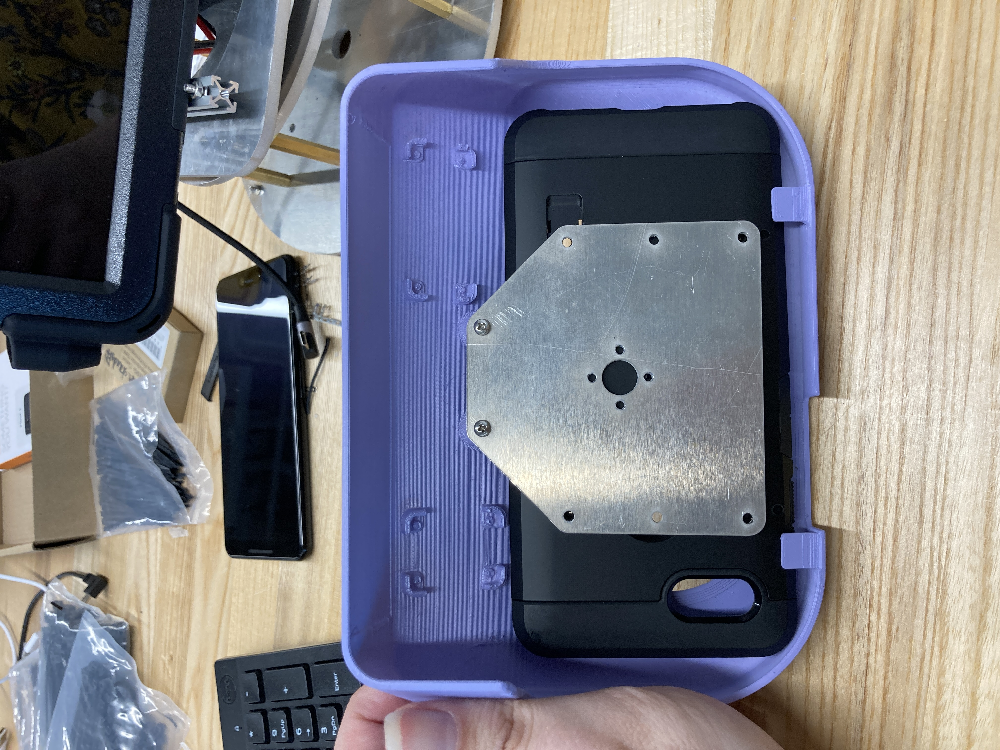
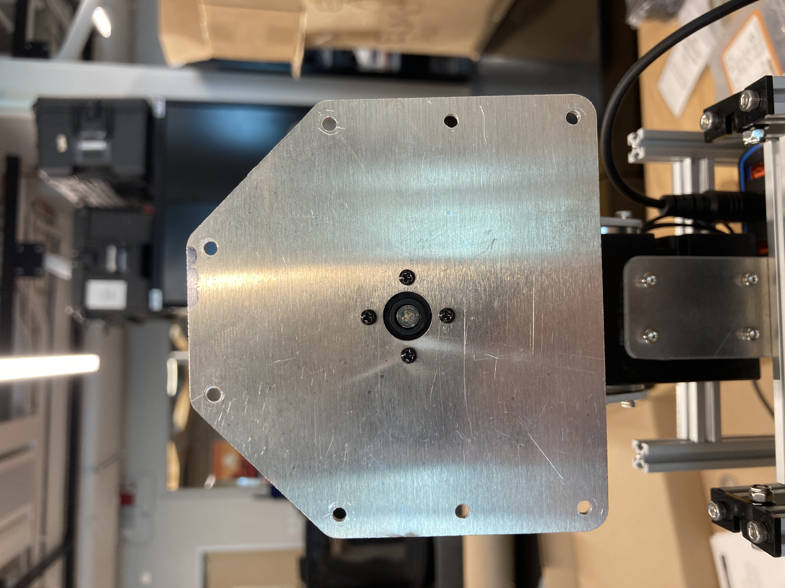
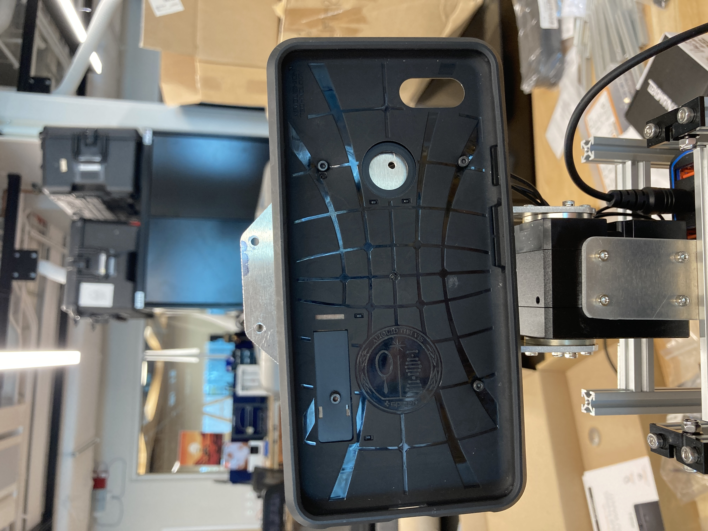
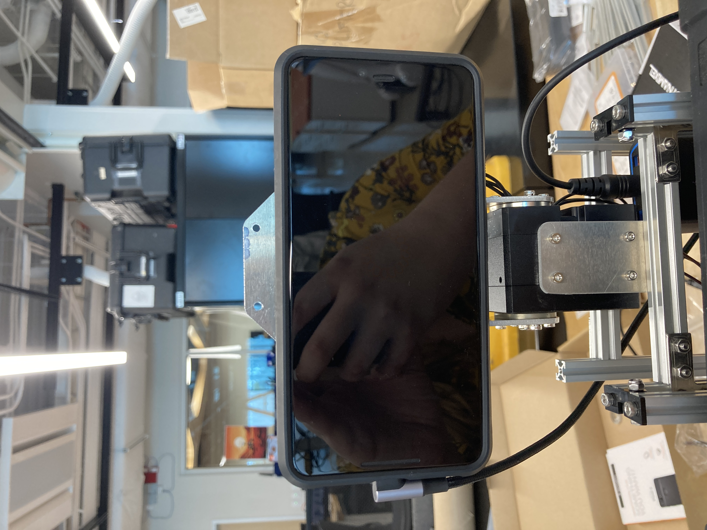
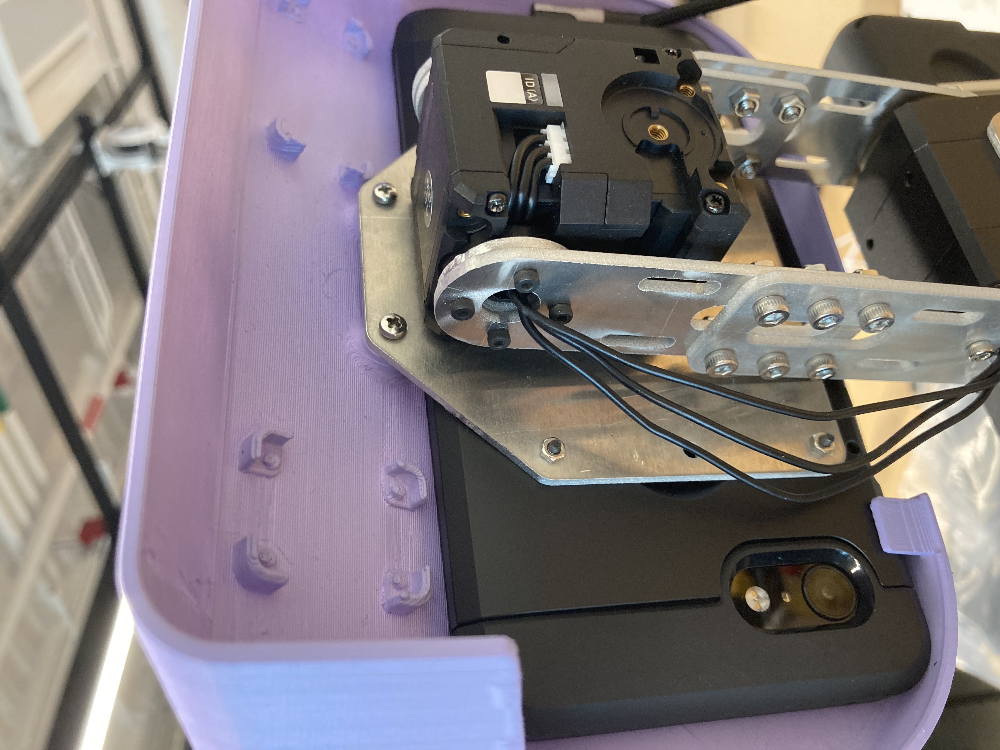
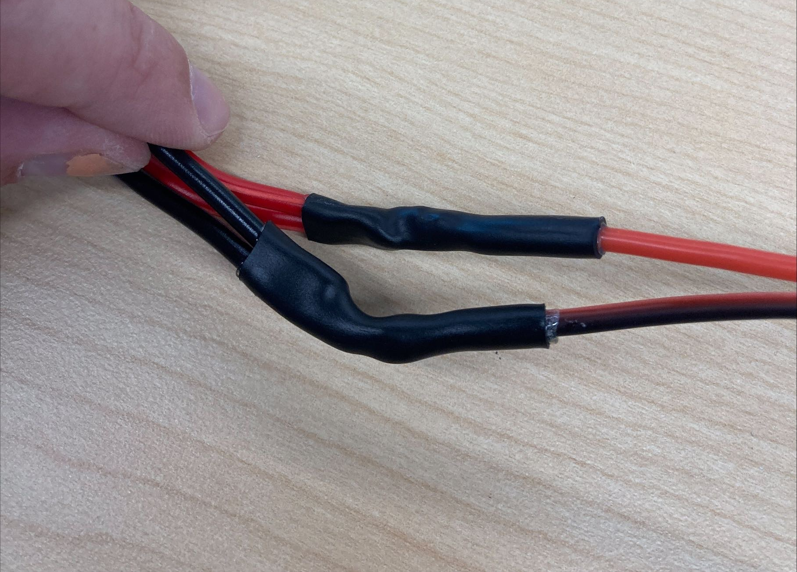
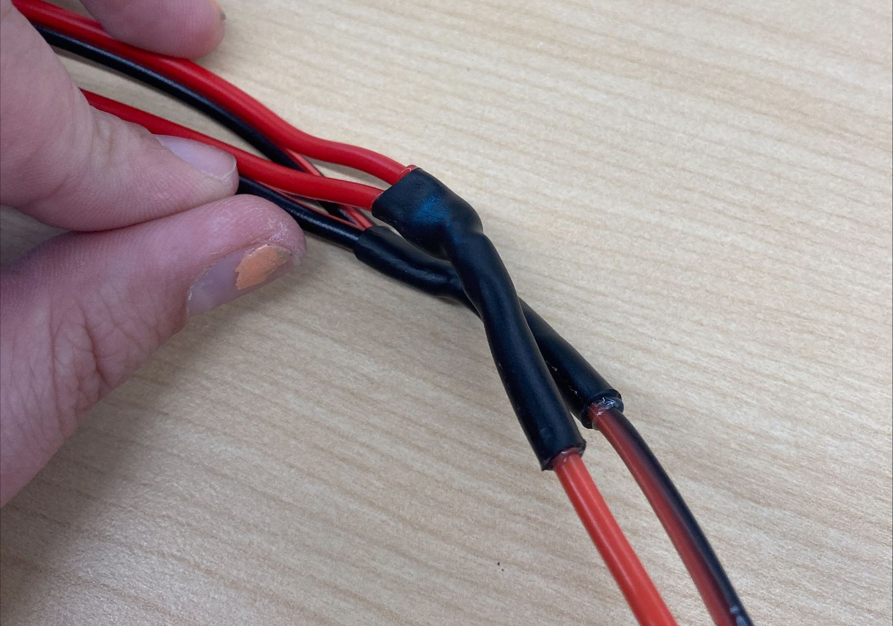
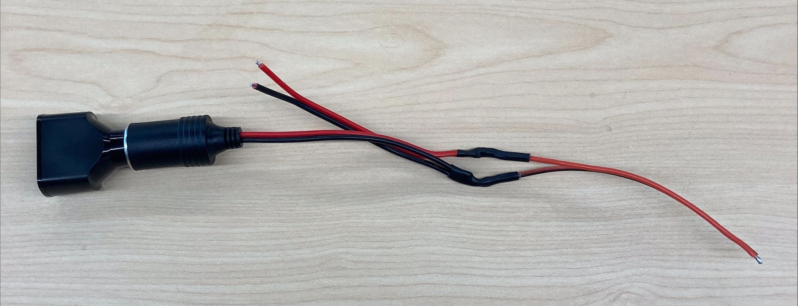

# FLEXI Hardware Construction

Hello there! Now, this may be fairly non-standard, but I'm here to explain to you how to build your own **FLEXI (any pronouns)**! The [original paper](https://osf.io/dbg6h/) on FLEXI is wonderful, but flawed. And in attempting to construct a FLEXI for the Robot Studio, this became clear to me. My name's Melodie Jaeger (she/they) and I will be guiding you through everything that was overlooked in the hustle and bustle that can come with trying to meet paper submission deadlines. 

In this document, I will be going over a few key topics that are necessary in order for you to construct your very own FLEXI. The instance of FLEXI that I built ended up being named **Violet (she/her)** and I will be using that designation to delineate between her and FLEXI as a wider designation for the project. The original paper neglected a few details here and there, and while I had access to Dr. Alves-Oliveira and her files on the project, not everybody does, so an addendum became necessary. As well, this addendum will serve as a gallery of photos of **Violet**, for reference on what FLEXI **should** look like, approximately. Outside of this introduction, I'll try to avoid unnecessary fluff as much as possible. Without further adieu, let's get into it!

## BoM Addendum 

First up, the BOM! I've included a list of everything that was excluded from the original BoM that is necessary for basic functioning of FLEXI, in the file `bom_addendum.csv`.

Not included in this mini-BoM is zipties, which I think are pretty common
for labs to have, and aren’t *necessary*, but will help you with cable management. A solder station and a bit of heat-shrink wouldn't hurt, either.

Oh, and make sure the USB-A to USB-C cable is right angle or 180 degree on the USB-C end. This is necessary for proper fitting of the faceplate over the Pixel.

## Aluminum Parts Fabrication

Next, since most of the structural parts of FLEXI are made of cut aluminum, I'm including some guidance on that. I can't tell you how to work whatever equipment is available to you, but I can advise on buying the material and laying it all out. 

A note for buying the stock, I was able to make an 8" by 8" sheet of .190" thick aluminum work for the largest part, `circular_base.dxf`. If you're not deeply confident in your ability to set up your cutting equipment with precision, you probably want to get a larger sheet, as this part has a diameter of 200 mm, allowing for only 3 mm of tolerance (8" = 203 mm). For purchasing the materials, I've included a little table of what to get, in the file `alu_stock.csv`.

The [OSF](https://osf.io/dbg6h/) repo contains the .dxf files for cutting all the parts for FLEXI, and then you can use a nesting software, such as [Deepnest](https://deepnest.io/) to arrange the parts on your stock sheets. 

## Faceplate 

The faceplate is a rather simple piece, made of a 3D printed part, `faceplate.stl`, and 2 M2.5 threaded heat-set inserts. I chose to paint the one on **Violet** a lovely lilac shade. This, in general, is one of the easiest parts to base little customizations and fun details around.

## Construction

Another goal of this document is to supplement the original instructions for building FLEXI. In building **Violet**, I had a lot of trouble with these instructions, especially since it looks like they tried to fit the entire process on one page, with varying results. There are also simply a few typos and mistakes that I'd like to save you some time with. Concerning the directions on page 1185 of the original paper:

- There is no direction on what fasteners to use for what. Use your best guess/intuition for this, and for most parts of the construction, it'll be fine. The kits in the BoM have plenty of nuts and bolts.
- Step 1 is very unclear about standoffs and spacers. I used M3 x 8 standoffs to attach the makerbeams to the part labelled "square base". I used a stack of washers for the parts labelled simply "spacers". Alternatively, for this step, you can use M3 screws and spacers, but the holes are sized for M4. It's probably fine either way.
- In Step 2, the motor labelled "Dynamixel motor" is the XH540-W270-T motor called for in the BoM.
- In Step 3, I would advise not attaching the phone plate just yet. What you should do is attach the phone case to the phone plate, using the faceplate as a jig to make sure everything fits together properly. 

- For securing the phone case to the phone plate, use the M2 screws and some M2 nuts. I used 4, as shown here:

    

- Also, in Step 3, the motor labelled as "Motor B" is the 2XC430-W250-T, and each of the two axes connected by the neck parts requires an idler. Look in the manuals for the idlers in the BoM to see which motors they correspond to. 
- Oh, and in Step 3, the part labelled "150MM Makerbeam" is, in fact, supposed to be a 100mm Makerbeam. Save yourself the headache of disassembly and reassembly.
- Step 4 is a bit tricky, so I've included an image that should help guide you through it: 
 

The remainder of the original instructions for building FLEXI are pretty simple and easy to follow, aside from the wiring. And it's my hope that some of the images I've included (in the `images` folder) can help.

## Wiring

The wiring documentation in the original paper is... lacking. I'm not convinced that this isn't a strange choice, but you may have noticed that it calls for a car charger for the Surface Pro, and then that is wired into a barrel plug in parallel with the U2D2. If there is future work on the desin of FLEXI, this is the most obvious place to start. I feel like a well-designed and very minimal PCB could handle some of this shall we say... jank.

 **Note**, by the way, that the U2D2 is wired differently for FLEXI than what the U2D2 [e-manual](https://emanual.robotis.com/docs/en/parts/interface/u2d2/) says. Otherwise, I found that the manuals from Robotis for the motors and U2D2 were very helpful.

The wiring on FLEXI truly isn't all that complex. In putting the thing together myself, I elected to forego the crimp connectors in the BoM for some good ol' fashioned splicing with heat-shrink and solder. If you don't know how to splice wires, you can find a ton of great online guides. Follow the wiring diagram included with the original paper, and use the barrel connector included in `bom_addendum.csv`. Here's a few images of the finished wires for the power:

In addition, there is a lot of wiring involved in making all of the connectivity that FLEXI needs to function. Some of the cables needed for this can be found in `bom_addendum.csv`, but basically, you just need to be able to pass a lot of data between the Surface, the Pixel, and the U2D2. Here's a wiring diagram that I found useful, but did not create. It was buried in the old google drive folder for this project:

## Gallery

I had a lot of images of FLEXI, and felt that pretty much all of them would be good to include. So, I'm basically just going to dump a bunch of photos in the `images` folder for reference.

## Future Work

So, I'm no longer working under Patricia, meaning that my time working on FLEXI is most likely at an end. But, were I to make some changes to FLEXI, I do have a few ideas:

### A Power Supply PCB Design

As I mentioned above, there are some problems with the electronics. The number one thing I'd like to see improved is a change to this car charger-based design. I can't imagine that creating a PCB design that accomplishes everything the car charger is used for would be too difficult, especially for an electrical engineer seasoned in PCB design.

### A Unified Documentation for the Software

The software for FLEXI is a bit disorganized. For its visual design, it implements [FLEX-SDK](https://dl.acm.org/doi/abs/10.1145/3526113.3545707) (link to [repo](https://github.com/mayacakmak/emarsoftware/wiki)), but you won't find a repository for the motor control online. I had access to some old Google Drive folders from the original project, and I still couldn't get it to work. Given a bit more time, getting **Violet** fully functioning was my goal, and this was an obstacle to that goal.

### A Stand-Alone Design

FLEXI uses a Google Pixel and a Microsoft Surface Pro. These aren't the most expensive bits (those would be the motors), but they do contribute to a large percentage of the budget for this project. It seems to me that rather than a browser-based system that also relies on running Python code for motor control via Windows, something more inspired by [Tulip](https://tulip.computer/) or [norns shield](https://monome.org/docs/norns/shield/) might be a better fit. (pardon my open source musician tendencies coming out)

What I mean is, something with:
- cheap hardware, based on something like the Tulip creative computer's touch screen display
- dedicated firmware, as opposed to this mess of poorly organized code. The kind of thing where you load the firmware on it, and it just *works*.
- and a system for making changes easily. Something running a barebones Linux OS would be perfect for this. FLEX-SDK attempts this, but feels like it needs a lot of polish. I'd personally be inclined to go with something like [maiden](https://monome.org/docs/norns/maiden/), the "app store" for norns.

## Acknowledgements

So obviously, I must thank Dr. Patricia Alves-Oliveira for giving me the opportunity to work on this project. It was a lot of fun, as well as being a valuable experience.

I also need to make a shoutout to Skye Krzykwa, who helped me with some of the electrical stuff. I came into this project with very little knowledge of electronics, and she might feel like she barely even helped, but I couldn't have built **Violet** without the help she provided.

